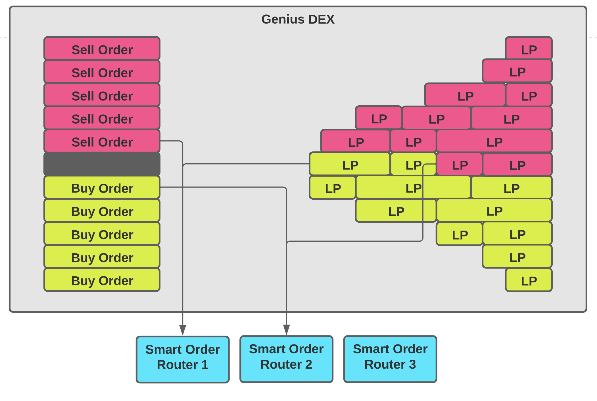

# Testing tokens

Minting Policy: "789824bb4bcdc53d96c9114a9aec50149eb0ec7198d292c172556ec1"
Token 1: "TokenA"
Token 2: "TokenB"

# DEX architecture diagram



# Competition asset classes

 - `fa2261efef35419afb055426b651b404356d803901a89c14cee9a926.TokenA`
 - `fa2261efef35419afb055426b651b404356d803901a89c14cee9a926.TokenB`

# geniusyield-orderbot

This is an order matching bot implementation that is meant to be modular and polymorphic. It uses backpack to support this goal.

Solid resource for learning backpack: https://github.com/danidiaz/really-small-backpack-example

# Development environment

In theory, you only really need `cabal` (and similar Haskell tooling) - and some generally expected system libraries and tooling to work with this project. You should also have `cardano-cli` available to generate a signing key.

You may also need to install a few system libraries: `libsecp256k1` and `libsodium`. Depending on your linux distribution, you may have to install the `-dev` versions which include the C headers.

In particular, a sufficiently updated version of `libsecp256k1` must be available. Older versions do not have `secp_extrakeys.h` which is required. If your distribution does not have up to date packages, you may have to build from source. `libsecp256k1` should also be built with the flags `--enable-module-schnorrsig --enable-experimental`.

If you want to use a haskell.nix based environment instead which includes all these (but takes a long time to initialize the first time), you can use the provided `flake.nix`.

Of course, you must have [nix](https://nixos.org/download.html) set up with the [flakes feature enabled](https://nixos.wiki/wiki/Flakes#Enable_flakes).

You must also set up the IOG binary caches following [the official guide](https://github.com/input-output-hk/haskell.nix/blob/master/docs/tutorials/getting-started.md#setting-up-the-binary-cache). If you do not do this, you'll end up building several copies of GHC from source - which is an extremely long process that may potentially fail.

Once you have the above all set up, you can run `nix develop` within the project root which will drop you inside a shell with everything you need, including `cabal`. After this point, you can do `cabal build all` and similar commands. You can also utilize the provided Makefile commands, such as `make orderbot-blockfrost` - which will start the orderbot with the `config-blockfrost.json` config.

Do note that the first time you set up this nix shell, it will take _a long_ time to build everything. However, next runs should be fast unless you severely modify the dependencies. Adding some deps from hackage into your cabal file is fine - but modifying the index-state may lead to build failures as newer packages might not be supported by the libraries! If you must use hackage packages newer than what is provided by the index-state, ask the organizers for help. They may be able to provide you with cabal `constraints` and `allow-newer` stanzas to fix build failures.

## Setting up config files

The two provided configs are missing the respective API key/token, which you will have to provide.

# Components

The orderbot has three modular components, two of them are modularized through backpack, and one of them is modularized just by virtue of being a higher order function.

The backpack-modularized components are:
- The data source where the orderbook is populated from (`lib-datasource`)
- The orderbook data structure (`lib-orderbook`)

The other component is the matching strategy. Which is a function that has access to an orderbook for each order asset pair, and performs order matchings to yield information on which orders/pools to match.

The returned information is then used to create and submit matching transactions.

# Adding implementation for components

The implementation for the data source component is already provided for participants to use. It is defined in `impl/datasource-providers`.

Participants will have to implement their own orderbook. An example implementation is provided in `impl/orderbook-list`. But of course, it is intentionally suboptimal! However, it should serve as a good example to get started with and even run the bot with!

You'll note that the Orderbook signature defines many orderbook querying functions. These are only provided as hints for the participants. You are not required to be limited by only using these functions in your strategy - you may have more functions here that you import in your `Main` file! Though you must provide at least these functions to make sure the signature is compatible with the implementation.

There is extensive documentation on understanding the types that are to expected to be used by all orderbook implementations, in `GeniusYield.OrderBot.Types`. It explains concepts with regards to asset pairs, orders and how they are separated into buy/sell etc.

You should **especially read** `mkOrderInfo` if you want to understand how DEX orders (which are always "sell" orders) are distinguished into buy and sell orders. This distinction is made to make it easier for the matching strategy writer to match orders.

# Provided implementations and running the bot

Once you have these two implementations, you can link them up in the `Main` file that will contain the bot execution itself. The provided `Main` file uses the provided datasource component (which Participants will also use), as well as the example `orderbook-list` implementation. You may check out the respective stanza in the `geniusyield-orderbot.cabal` file for this executable (`geniusyield-orderbot-exe`), which showcases how cabal mixins may be used to link up backpack signatures with their implementations:

```cabal
executable         geniusyield-orderbot-exe
  import:          common-lang
  import:          common-deps
  import:          common-ghc-opts
  main-is:         Main.hs
  build-depends:
    , geniusyield-orderbot-framework
    , geniusyield-orderbot-framework:common
    , geniusyield-orderbot:datasource-providers
    , geniusyield-orderbot:orderbook-list
  mixins:
    , geniusyield-orderbot:orderbook-list requires
        (GeniusYield.OrderBot.DataSource as GeniusYield.OrderBot.DataSource.Providers)
    , geniusyield-orderbot-framework requires
        ( GeniusYield.OrderBot.DataSource as GeniusYield.OrderBot.DataSource.Providers
        , GeniusYield.OrderBot.OrderBook as GeniusYield.OrderBot.OrderBook.List
        )
  ghc-options:
    -O2 -threaded -rtsopts -with-rtsopts=-N
```

Most likely, participants will replace the `geniusyield-orderbot:orderbook-list` dependency with their own implementation library. Once they have done that, the mixin must be accurately updated.

Consider, a custom orderbook implementation defined in a cabal sublibrary `geniusyield-orderbot:orderbook-tree`. Suppose, the implementation module in said library is: `GeniusYield.OrderBot.OrderBook.Tree`. Then, the new stanza would look like:

```cabal
executable         geniusyield-orderbot-exe
  import:          common-lang
  import:          common-deps
  import:          common-ghc-opts
  main-is:         Main.hs
  build-depends:
    , geniusyield-orderbot-framework
    , geniusyield-orderbot-framework:common
    , geniusyield-orderbot:datasource-providers
    , geniusyield-orderbot:orderbook-tree
  mixins:
    , geniusyield-orderbot:orderbook-tree requires
        (GeniusYield.OrderBot.DataSource as GeniusYield.OrderBot.DataSource.Providers)
    , geniusyield-orderbot-framework requires
        ( GeniusYield.OrderBot.DataSource as GeniusYield.OrderBot.DataSource.Providers
        , GeniusYield.OrderBot.OrderBook as GeniusYield.OrderBot.OrderBook.Tree
        )
  ghc-options:
    -O2 -threaded -rtsopts -with-rtsopts=-N
```

# Customizing the bot

Now that you know how to set up the project itself and link components. Of course the next step is to write a matching strategy that beats out everyone else's! A very simple sample strategy is provided in the example `Main` file. Of course, it uses the list based orderbook and therefore it uses list functions in the strategy. You can use your custom functions in your strategy once you import the respective Orderbook implementation.

What else is there to customize? Quite a lot actually! Here's what the `OrderBot` type looks like:

```hs
-- See: GeniusYield.OrderBot

-- | The order bot is product type between bot info and "execution strategies".
data OrderBot = OrderBot
  { -- | Signing key of the bot.
    botSkey :: !GYPaymentSigningKey
  , -- | UTxO ref of the collateral UTxO in the bot's wallet.
    botCollateral :: !GYTxOutRef
  , -- | The execution strategy, which includes and governs the matching strategy.
    botExecutionStrat :: !ExecutionStrategy
  , -- | Function that can be used to filter out uninteresting orders/pools.
    --
    --    Before retrieving all information on an order/pool, this function will be applied
    --    on the 'GYAssetClass'(s) it contains. If it returns true for _any of the assets_
    --    contained within, the order/pool will be fetched.
    botAssetFilter :: GYAssetClass -> Bool
  , -- | Handler for exceptions that may be raised during bot run. It'll also have access to the matched orders.
    --
    --    NOTE: This handler is when used during tx build and submission step. It is assumed all other
    --    steps are pure and should not raise exceptions under usual circumstances. This also applies to the
    --    OrderBook population step (when user supplied 'populateOrderBook') is called - which is similarly
    --    assumed to not fail.
    --
    --    If you find exceptions outside of the tx build/submission step common, you may wrap 'runOrderBot' with
    --    a "Control.Exception.try" or similar and handle/restart your bot from there.
    botOnException :: [MatchExecutionInfo] -> SomeException -> IO ()
  , -- | How many microseconds to wait after a tx submission before rescanning the chain for orders.
    botRescanDelay :: Int
  }
```

Once you have this data type constructed, you simply pass it to the function `GeniusYield.OrderBot.runOrderBot`. Let's see what the example strategy uses:

```hs
OrderBot
    { botSkey = skey
    , botCollateral = collateral
    , botExecutionStrat = MultiAssetTraverse $ \_ bk -> sampleStrategy bk
    , botRescanDelay = 50_000_000 -- 50 Seconds
    , botAssetFilter = const True -- Fetch everything!
    , botOnException = \matchSet err -> do
        print err
        BSL.putStr $ AesonE.encodePretty matchSet
        putStrLn "\n"
    }
```

We will discuss the `skey` and `collateral` [below](#logistics-and-orchestration), for now: notice that you are able to set the following:

- The execution strategy itself, which contains the respective matching strategy.

  Currently, there is only one matching strategy: `MultiAssetTraverse`. What does this mean? In the real world, the DEX orders
  will consist of many many unique asset pairings; which means there will be an `OrderBook` for each asset pair. The `MultiAssetTraverse`
  is meant to independently traverse over each of these `OrderBook`s and yield matches.

  For the hackathon, there will only be one asset pair. The identifier of which, will be provided to you by the organizers. So in that sense, `MultiAssetTraverse` is the only execution strategy that makes sense and of course it will only have one orderbook within it.

  The execution strategy then takes a function as an argument. _This_ is your matching strategy. You will have access to the orderbook and its respective unique `OrderAssetPair` within this strategy, and you are expected to return information on matches in form of `MatchExecutionInfo`.

  There is extensive documentation on `OrderAssetPair` and relevant types in `GeniusYield.OrderBot.Types` - you should read this to understand how to work with them in your matching strategy.

  Documentation on `MatchExecutionInfo` can be found in `GeniusYield.OrderBot.MatchingStrategy`.

- The rescan delay. This is the amount of micro seconds to wait after a transaction submission before the blockchain is scanned again for changes in the DEX.

  Remember that changes in the blockchain take time! You cannot submit transactions back to back. It is the participants' responsibility to figure out the optimal waiting time!

  Make it too high, and your bot will slow down compared to others. Make it too low and you'll be wasting precious computation resources on transactions that ultimately fail!

- An asset filtering function. Only orders with assets for which this function returns true will be fully fetched. It is highly recommended that Participants utilize this to increase throughput. The final competition will use a constant `PolicyId`, which will be given to you by the organizers - you may filter for only the asset classes with that policy id.

  Of course, the example simply fetches everything.

- The exception handler. This handles exceptions raised during transaction build and submission. There _will_ be various exceptions during such a stateful operation. It might range from user errors like improper matching, to contention errors on the chain due to other bots trying to match the same orders! It's the participants' responsibility to potentially scrutinize and handle these exceptions.

  The handler will also have access to the list of `MatchExecutionInfo` returned by your strategy that caused the transaction to fail.

  What about exceptions raised during other operations in `runOrderBot`, other than transaction build/submission? These are not wrapped
  by your provided exception handler. The assumption is that the other components _should not_ fail, ideally. However, if you do see them
  failing, wrap the `runOrderBot` call with a `try`, or `catch`, or similar where you can have another exception handler. However, do note that you'll of course have to call `runOrderBot` again to restart the bot in this handler, since it crashed!

# Logistics and Orchestration

The `Main` executable takes a path to a config file containing some information to run the bots. This is meant to be passed as a command line argument.

There are two sample configs provided: `config-maestro.json` and `config-blockfrost.json`. There are also two `make` commands to run the bot with them, respectively: `make orderbot-maestro` and `make orderbot-blockfrost`

The configuration file describes the blockchain information provider to use. The supported providers can be seen in: `GeniusYield.OrderBot.Config.GYCoreProviderInfo`. We expose two easy to use providers in this repository:

- The Maestro blockchain API, provided by Maestro.
- Blockfrost

Both of these need an API token.

The Maestro API token is simply a number; `config-maestro.json` uses `42` as an example - but it is not the correct API token! Please replace it with the proper API token, which will be provided to you by the Hackathon organizers.

You can obtain a Blockfrost API key by creating a Blockfrost account and then a project with the `Preprod` testnet. Paste said key inside `config-blockfrost.json`.

Finally, you need to create a signing key that the bot will use, as well as a collateral UTxO within the bot's wallet. Save the signing key to a file.

The example main file sets up the scaffolding for using the `skey` and the `collateral`:

```hs
skey <- readPaymentSigningKey "bot.skey"
let collateral = "ca54517fd33bb9abafc1c48eb7e3ee6a7681b5ef38a4eaa8e56ab717b7705622#1"
```

Replace `bot.skey` with the path to your bot's signing key.

Replace `collateral` with a UTxO reference of the collateral in the bot's wallet which it will use to interact with smart contracts. Notice that the `collateral` can be specified using a string that contains the Transaction Id hash and the UTxO index, joined by a `#`.

For instructions on creating a signing key and collateral, refer to: [Setup wallet instructions](setup-wallet.md)

You must provide the wallet address of the bot to be eligible for the final competition!

# Matching strategy tips

- Remember that you should only match orders where the overall arbitrage profit is _at least_ a whole number. Payment to a DEX order is always ceiled, so if the calculated payment is `2.13` tokens, the order actually gets paid `3` tokens. So if you expected arbitrage profits in change, it's not going to happen!

- Don't return too many 'MatchExecutionInfo's! There is a limit to how many transactions can be matched in a single transaction. The exact limit, will have to be found out by the Participants.

  When you try to match too many orders in one transaction, you'll see `ExUnitsTooBigUTxO` within the raised exception.

# Common Transaction Exceptions

- `ExUnitsTooBigUTxO` in the exception means you are trying to match too many orders at once, making the transaction size cross the limit.
- `BalancingErrorInsufficientFunds` in the exception indicates there are not enough of one or many tokens to construct the tranasction. If you see ada in the value that is printed afterwards, it means your bot is out of ada. More often however, this error will be raised if your matching strategy does not return proper order matches and there aren't enough tokens in the transaction bucket to pay an order.
- `GYTxMonadException "partiallyFillPartialOrder: amount x must be smaller than offered amount x` - You are trying to partially fill an order, but the partial fill amount is the max volume of the order. Use `CompleteFill` instead. See `GeniusYield.OrderBot.MatchingStrategy.FillType` for more information.
- `BadInputsUTxO` in the exception that is raised during tx submission, _not creation/balancing_, usually indicates contention. An order you are trying to match is being matched by another transaction.

# Troubleshooting

- HLS will not work in signature modules, nor will it work in modules importing a signature module. Importing implementation modules is fine though!

- The order of type variables in a `forall` must match exactly in the signature and implementation. Remember that the order of type variables in implicit foralls is well defined - that is, it is simply in the order they appear from left to right, in the type signature.

- If you see an error like this in within the nix shell:

  ```
  ghc: panic! (the 'impossible' happened)
  (GHC version 8.10.7:
    getPackageDetails: couldn't find package
  blockfrost-api-0.6.0.0-<hash>
  ```

  Exit and re-enter the nix shell: `exit`, followed by `nix develop`.

# DEX

## Table of Content

 - [Introduction](#introduction)
 - [Orders](#orders)
 - [Partially Fillable Orders](#partially-fillable-orders)
 - [Liquidity Positions](#liquidity-positions)
 - [NFT](#nft)

## Introduction

The purpose of the DEX smart contracts is to implement a _DEX_, a _Decentralized Exchange_, i.e. a means for users to swap (Cardano native) tokens,
which include ada and arbitrary custom tokens. This is _Decentralized_ in the sense that no central authority
(like a traditional, centralized exchange) is needed: Users can swap without needing to trust some authority or each other.

We anticipate two types of users, those who are primarily interested in swapping one kind of token for another and _liquidity providers_,
who facilitate swaps by providing liquidity (i.e. large amounts of tokens).
Normal users have one sort of token and want to exchange it for another.
Liquidity providers want to earn fees by making it easier for normal users to perform their swaps.

The process works as follows: Users who want to swap _place orders_ on the blockchain (in the form of an UTxO "sitting" at
a script address). They include their "offer" (the tokens they want to swap) in their order and state their price (in the datum).
Anybody who is willing to pay the price can do so by _filling_ the order, i.e. paying the price in exchange for the offered tokens.

Liquidity providers open _liquidity positions_ by placing tokens of two sorts in an UTxO on the blockchain at another script address.
These liquidity positions specify a price, and anybody can put tokens of the one sort into a position in exchange for getting tokens of the other
sort out - at the specified price.

Liquidity positions make it easier to fill orders: If an order offers some amount of a token A in exchange for some amount of a token B
and if there is a liquidity position containing A's and B's in sufficient quantity and at an appropriate price,
then the order can be filled by utilizing the liquidity position.

Orders and liquidity positions are not "aware" of each other and can be freely combined in transactions.
It is in principle possible to fill several orders in one transaction using several liquidity positions.

Anybody can fill orders and use liquidity positions for swaps. We anticipate that there will be a large number of "bots",
programs that scan the blockchain for open orders and use diverse strategies to fill them - with or without the help of liquidity positions.
Those bots can "pocket" any arbitrage they encounter, which will motivate bot authors and lead to a healthy competition among them,
resulting in orders being filled swiftly and the market becoming as efficient as possible.

Our DEX architecture is very open and extensible, but at the moment, we support two types of orders and one type of liquidity positions.
In total, we have four different smart contracts powering our DEX:

 - [_Orders_](#orders). A simple order that has to be filled in one transaction.
 - [_Partially Fillable Orders_](#partially-fillable-orders). A more complex order that can be filled in several transaction,
   each only taking part of the offered tokens and paying part of the price.
 - [_Liquidity Positions_](#liquidity-positions). Deposits of two types of tokens that can be swapped in both directions at a specified price.
 - [_NFT_](#nft). A simple NFT minting policy which is used by both partially fillable orders and liquidity positions
   to track their "identity" over their lifetime. There is no mutable state in the EUTxO-model. To simulate state, UTxO's have to be consumed,
   and new ones (with modified value and/or datum) have to be created. NFT's are passed from one UTxO to the other to provide continuity
   and to identify the old and new UTxO as representing the "same" abstract order respectively liquidity position.

## Orders

Orders contain an arbitrary value (which can in principle be a _bag_ of different tokens)
and specify a _price_ (which is again an arbitrary value, not necessarily just consisting of one token).
Their datum specifies the _pubkey hash_ of the _owner_ (the user placing the order), the owner's _address_ and the _price_.

Orders support two types of "actions" (ways to consume them), they can be _cancelled_ or _filled_.

 - A transaction _cancelling_ an order needs to be signed by the owner.
 - To _fill_ an order, the specified price needs to be paid to the owner's address.

Orders are supposed to be composable with other orders and with liquidity positions, so we must be careful to not run afoul of the
_double satisfaction problem_, where a malicious player could fill several orders but only pay once.
It is surprisingly difficult to write a validator in a way that prevents this, because validators run independently of each other
and can't communicate, so a validator can't simply "claim" a specific payment for itself.

We solve this by making use of the fact that _every_ UTxO on the Cardano blockchain can have a datum attached - not just UTxO's at script addresses.
We will attach a reference to the filled order as datum to each payment, thus making payments for different orders distinguishable.

## Partially Fillable Orders

The partial order mechanism allows one to lock their offered tokens inside a validator, which
can then be either completely or partially filled/bought by another user - according to the price.

Each order contains a specific NFT to identify it. Its `TokenName` must be
present in the order datum upon order creation. The `CurrencySymbol` of this NFT is defined in NFT.hs (see [NFT](#nft)!).

This order validator is parameterized over three arguments:

- The NFT minting policy ID

- A constant lovelace amount to pay for the order-filler's (buyer's) transaction fees, for a single transactions.

  A total fee amount is calculated based on this initial fee parameter, and the maximum number of partial filling
  transactions that can be done for the order - this total fee amount should be present at the UTxO during initial
  construction.

  For example, if the offer amount is 110. min filling is 20, and fee is 2 Ada, then the maximum number of partial transactions
  that can be done is $\lceil 110/20\rceil = 6$. So, $6\cdot 2 = 12$ Ada should be provided to the UTxO during construction to pay for each
  of those transactions' fees.

- A constant lovelace amount to pay for the deposit after a partial fill.

  This is similar to the fee amount in purpose. This corresponds to a minimum Ada amount that has to be present in an UTxO
  alongside other tokens.

  In the above example, there can be at most 6 fillings, so at most 5 _partial_ fillings, which means the deposit should be included
  five times upon order creation.

Once an order is properly constructed, it can be interacted with in one of three ways:

1. _Cancel_ - The order is cancelled, allowing the UTxO with the offer amount to be reclaimed.

    Requirements:
      - Must be signed by the owner of the order. The owner's pub key hash is put into the order datum upon creation.
      - The NFT identifying the order must be burnt, lest it escapes into another UTxO.

2. _Complete fill_ - The full offered amount is bought, for the full price.

    Requirements:
      - Payment must be made to a UTxO at `podOwnerAddr`, containing a datum that contains the
        `TxOutRef` of the order UTxO. (i.e `ownRef` within the validator).
        The owner address is put into the datum during construction.
      - The payment must be greater than, or equal to, the price (in the asked-for asset) for the full
        offer amount, it must also include the _full_ deposit amount. However, the transaction fee for one transaction
        (corresponding to the fee parameter) may be deducted.
      - The NFT identifying the order must be burnt, lest it escapes into another UTxO.

3. _Partial fill_ - a portion of the offered amount is bought, for the corresponding price.

    Requirements:
      - The portion/amount must be positive, but less than the remaing total amount,
        and it must be greater than or equal to `podMinFilling`, which is put
        inside the datum during order creation. This is effectively the minimum amount one must buy even during a partial filling.
      - Payment must be made to a UTxO at `podOwnerAddr`, containing a datum that contains the
        `TxOutRef` of the order UTxO. (i.e `ownRef` within the validator)
        The owner address is put into the datum during construction.
      - The payment must be greater than, or equal to, the price (in the asked-for asset) for the corresponding portion
        of the offer amount, it must also include the deposit amount (single UTxO deposit), as given by the parameter.
        However, the transaction fee for one transaction (corresponding to the fee parameter) may be deducted.
      - A single continuing output must be present, with the remaining amount inside, alongside an updated datum.
        In particular, the `podOfferedAmount` will be subtracted by the amount that has just been sold, and one deposit can be deducted.

## Liquidity Positions

Liquidity providers can _open_ a _liquidity position_ by placing two sorts of tokens (with arbitrary amounts) at a UTxO
"sitting" at the script address. Valid liquidity positions need to contain an [NFT](#nft) to track their identity,
and they need to specify various parameters in the datum.

The most important operation supported by such a liquidity position is that of _swapping_ one sort of tokens for the other:
A transaction consumes the UTxO and recreates a new one at the same address with adjusted amounts of tokens (according to the price).

Each such swapping transaction needs to pay a _fee_ to the liquidity provider. This fee is paid in the token being swapped
and remains in the position, so that the amount of tokens in the position grows with each swap.
Part[^1] of that fee is meant for GeniusYield, but also remains in the position until it is withdrawn or the position is closed.

The _datum_ contains the following information:

```haskell
data LiquidityDatum = LiquidityDatum
    { ldOwner     :: !PubKeyHash                           -- ^ Pubkey hash of the owner (i.e. the liquidity provider).
    , ldNFT       :: !TokenName                            -- ^ Token name of the NFT tracking the identity of the liquidity position.
    , ldFrom      :: !AssetClass                           -- ^ One of the tokens in the position.
    , ldTo        :: !AssetClass                           -- ^ The other token in the position.
    , ldPrice     :: !(PlutusTx.Integer, PlutusTx.Integer) -- ^ The price for one unit of the "from" token in terms of the "to" token, given as numerator and denominator of the actual rational price.
    , ldFee       :: !(PlutusTx.Integer, PlutusTx.Integer) -- ^ The fee due for each swap, given as numerator and denominator of the actual rational proportion.
    , ldGYFeeFrom :: !PlutusTx.Integer                     -- ^ GeniusYield fees in terms of the "from" token contained in the position.
    , ldGYFeeTo   :: !PlutusTx.Integer                     -- ^ GeniusYield fees in terms of the "to" token contained in the position.
    , ldMinFrom   :: !PlutusTx.Integer                     -- ^ Minimal amount of "from" tokens that need to be swapped.
    }
```

For a liquidity position to be considered valid, a number of conditions have to be met. Our offchain code will not consider invalid positions,
and nobody else should either - all bets are off for invalid position.
The validator must guarantee that no operation causes a position to become invalid.
These condiftions are:

 - The specified NFT must be present in the position.
 - `ldFrom` and `ldTo` must be different.
 - `ldPrice` must be positive.
 - `ldFee` must not be negative.
 - `ldGYFeeFrom` must not be negative, and the amount of "from" tokens in the position must be greater or equal than `ldGYFeeFrom`.
 - `ldGYFeeTo` must not be negative, and the amount of "to" tokens in the position must be greater or equal than `ldGYFeeTo`.

The following operations are supported:

```haskell
data LiquidityAction = Swap        -- ^ Perform a swap.
                     | CollectFees -- ^ Collect the GeniusYield fees.
                     | Update      -- ^ Update the parameters of the position.
                     | Close       -- ^ Close the position.
```

These operations work as follows:

 - `Swap`: A transaction consumes the position and recreates it with updated values and datum.
   Let us consider an example where the position contains 127 "from" tokens and 315 "to" tokens,
   where the price is `(3,2)` (i.e. 1.5), the fees are `(1,20)` (i.e. 5%) and the GeniusYield fees are 10%.
   Let us assume that `ldGYFeeFrom` is 10 and `ldGYFeeTo` is 5, i.e. 10 of the 127 "from" tokens belong to Geniusyield,
   as do 5 of the 315 "to" tokens.

   A user wants to swap 104 "from" tokens for "to" tokens.

   The fees are 5% of 104, i.e. 5.2, which are rounded up to 6 "from" tokens. Of those, 10% go to GeniusYield, which is - we round up again -
   one "from" token.

   104 - 6 = 98 tokens remain for the swap. Using the price of 1.5, that gives us 147 "to" tokens[^2].
   So the user places 104 "from" tokens in the position and gets 147 "to" tokens out of it.
   The new position contains 127+104=231 "from" tokens (of which 10+1=11 belong to GeniusYield) and 315-147=168 "to" tokens
   (of which 5 belong to GeniusYield).

   The datum of the new UTxO is identical to the old datum with exception of the `ldGYFeeFrom` field, which is now 11 instead of 10.

   Let us now assume that another user wants to swap 77 "to" tokens.

   The fees are 5% of 77, which is 3.85, rounded up to 4. 10% of that, again rounded up, is one token for GeniusYield.
   Of the 77 "to" tokens, 77-4=73 remain for the swap. Seeing as we swap in the _opposite_ direction, the price is now 2/3,
   which gives us 48.666... "from" tokens. These are rounded _down_ to 48.

   The user therefore puts 77 "to" tokens in, leaving 168+77=245 "to" tokens, and takes 48 out, leaving 183. Of those,
   11 "from" tokens belong to GeniusYield, as do 5+1=6 "to" tokens.

   The datum of the newest UTxO is again identical except for the `ldGYFeeTo` field, which is now 6.

   Users can swap arbitrary amounts, but they obviously can only get out what is there. So in our example, a user swapping "from" tokens
   can at most receive 245-6=239 "to" tokens, and a user swapping "to" tokens can at most receive 183-11=172 "from" tokens.
   She would probably refrain from swaps giving her less than the price dictates, but she is free to do so. All the validator checks
   is that the liquidity provider and GeniusYield get what is their due
   (and that the NFT remains in the position and that the datum is updated correctly).

 - `CollectFees`: GeniusYield can submit a transaction to collect their fees.
   Such a transaction must be signed by GeniusYield, it must (at most) take out the amount specified by the `ldGYFeeFrom` and
   `ldGYFeeTo` fields, and it must update the datum to `ldGYFeeFrom` = `ldGYFeeTo` = 0.

 - `Update`: The liquidity provider can update certain datum fields and take liquidity out or put new liquidity in, provided

     - The NFT remains in the position.
     - The GeniusYield fee remains in the position (and is not changed in the datum).
     - The two assets "from" and "to" are not changed.
     - The position remains valid (positive price, non-negative fees).

 - `Close`: The liquidity provider can close the position, provided the NFT is burnt and GeniusYield is paid their fees[^3].

## NFT

The purpose of this minting policy is to guarantee that every token with this policy - independent of its token name - is an NFT,
i.e. a _non-fungible token_, a token that can only exist at most once.
The minting policy is _not_ parameterized and thus statically known, which makes it easy to use in other contracts that are in need of an NFT.
Once one has convinced oneself that each token with this policy is indeed an NFT, one can simply use this policy whenever an NFT is required.

This is achieved by making use of a redeemer for the minting transaction. The redeemer specifies a UTxO (via its `TxOutRef`) that has to be
consumed by the minting transaction. The minting policy checks that the specified UTxO is indeed consumed,
that exactly one token is minted (whereas arbitrary _burning_ is allowed)
and that the token name of that one token is the _hash_ of the `TxOutRef` of that UTxO.

Since UTxO's are unique and can only exist once, this guarantees that only one token with this minting policy and token name can ever be minted
(except, of course, if there is a _hash collision_, but we deem this risk to be negligible).

[^1]: The ratio of fees going to GeniusYield is a global system parameter.
[^2]: If the amount of "to" tokens was not integral, we would round _down_ to the next integer.
